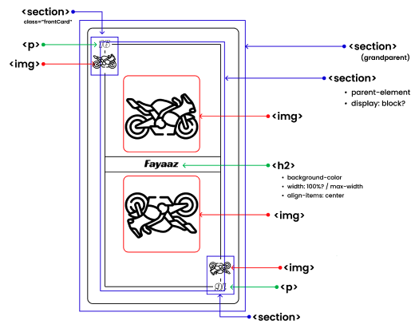
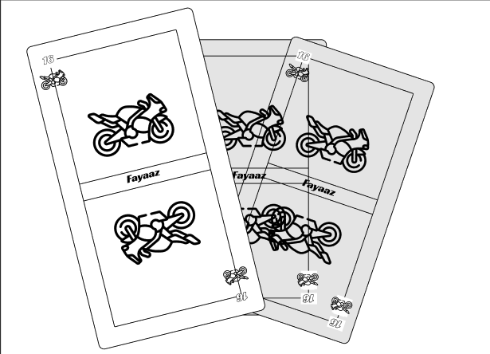
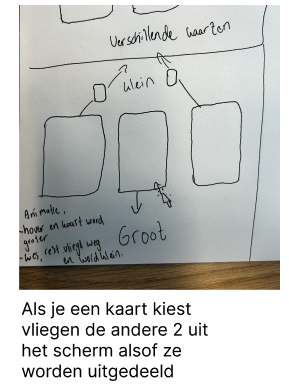
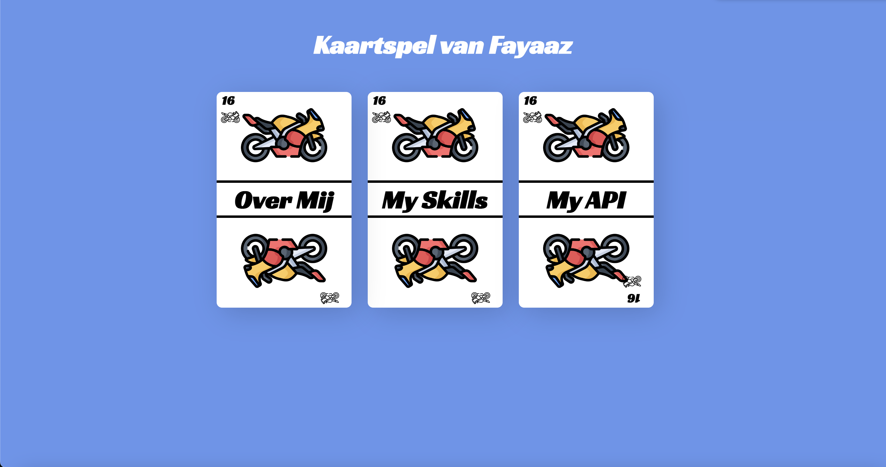

# Kaartspel van Fayaaz

Voor de opdracht moest ik een persoonlijke website maken. Hiervoor heb ik gekozen om een kaarspelletje te maken met 3 catagorieen. Deze kaarten vertellen wat meer over mijzelf op een leuke en interessante manier.

## De opdracht
Maak een SPA (Single Page Application) die past bij jezelf. Schrijf die in Semantisch correcte HTML en CSS. Gebruik daarvoor ook een API.

## Stappenplan
### Stap 1 - Schetsen
Ik heb verschillende schetsen gemaakt om mijn project vorm te geven.






### Stap 2 - Datastructuur
Nu ik weet welke data ik allemaal nodig heb kan in een lijstje maken met data die ik nodig ga hebben voor de JSON file.

```json
{
    "firstName": "Fayaaz",
    "lastName": "Nabie",
  "avatar_url": "https://raw.githubusercontent.com/Fayaaz036/WAPS/00a97cea8d741d1f37b9f5eb5c37849556f05413/img/avataraboutme.png",
    "dateofbirth": "16-05-2001",
    "city": "Almere",
    "age" : "22",
    "openForJobProposals" : true,
    "pages" : ["Over Mij", "My Skills", "My API"],
    "bio" : ["Ik ben Fayaaz, 22 jaar oud en afkomstig uit Almere. Momenteel ben ik bezig met de minor Web Design & Development aan de Hogeschool van Amsterdam. In mijn vrije tijd ben ik gepassioneerd bezig met motorrijden, waarbij ik de vrijheid van de open weg omarm. Daarnaast vind ik het heerlijk om te sleutelen aan mijn scooter.",
             "Tijdens mijn studie heb ik ervaring opgedaan met HTML, CSS en JavaScript. Hoewel ik goed overweg kan met HTML en CSS, vind ik JavaScript nog wat uitdagend. Mijn doel is om mijn kennis van JavaScript te verdiepen, zodat ik nog beter als ontwikkelaar verder kan ontwikkelen.",
            "Voor de API opdracht heb ik gekozen om alle data uit een JSON FIle te halen. Ik heb een HTML skelet gemaakt, en die ingevuld met de data uit een JSON file die op github staat. "
    ],
    "kaartnummer" : "16",
    "avatars" : ["https://raw.githubusercontent.com/Fayaaz036/WAPS/43ff41b10fab8ae3abe84b97153b840d5eb576ae/img/avataraboutme.png",
                "https://raw.githubusercontent.com/Fayaaz036/WAPS/43ff41b10fab8ae3abe84b97153b840d5eb576ae/img/avatarskills.png",
                "https://raw.githubusercontent.com/Fayaaz036/WAPS/43ff41b10fab8ae3abe84b97153b840d5eb576ae/img/avatarmusic.png"
    ],
  "turnAroundText" : "Draai je telefoon om verder te gaan :)"
}
```
### Stap 3 - Kaarten in HTML maken
Ik heb gekozen om de kaarten als lege html elementen in de index in te laten. Dat doe ik d.m.v figure. Hier kan ik een voorkant en achterkant meegeven en switchen tussen die 2 faces.

```html
    <figure>
      
      <!--figure van voorkant-->

      <figcaption class="voorkant">
              <section class="iconboven">
                <h2 class="kaartnummer"></h2>
                
              </section>

              <section class="midden">
                
                <h2 class="pagename"></h2>
                
              </section>

            <section class="icononder">
              <h2 class="kaartnummer"></h2>
              
            </section>
      </figcaption>
      
            <!--figure van Achterkant-->
      
        <figcaption class="achterkant">
          <section class="iconboven">
            <h2 class="kaartnummer"></h2>
            
          </section>

          <section class="midden">
            
            <h2 class="pagename"></h2>
            <p class="bio"></p>
          </section>
          <section class="icononder">
            <h2 class="kaartnummer"></h2>
            
          </section>
        </figcaption>
    </figure>

```

## stap 4 - Javascript schrijven
De javascript file bevat verschillende functies. Zoals de class switchen naar .Flipped en andersom met de empty state.
```js
container.addEventListener('click', function(event) {
    const clickedCard = event.target.closest('article')
    const flippedCard = document.querySelector('.container article.flipped')

    if (flippedCard && clickedCard !== flippedCard) {
        flippedCard.classList.remove('flipped')
        isKaartFlipped = false
    }

    if (clickedCard && !clickedCard.classList.contains('flipped')) {
        clickedCard.classList.toggle('flipped')
        isKaartFlipped = true
    }
})
```
### Data ophalen van de JSON
```js
const githubJsonUrl = 'https://raw.githubusercontent.com/Fayaaz036/WAPS/master/data.json'
```
### Data invullen van de JSON in de cards
Door mijn github Url te fetchen waar de JSON file in staat kan ik de data veilig in de cloud laten bewaren.
```js

async function haalKaart1op() {
const reactie = await fetch(githubJsonUrl);
const data = await reactie.json();
kaart1.querySelector('.achterkant img.avatar').src = data.avatars[0];
kaart1.querySelector('.voorkant .pagename').textContent = data.pages[0];
kaart1.querySelector('.achterkant .pagename').textContent = data.pages[0];
kaart1.querySelector('.bio').textContent = data.bio[0];
kaart1.querySelector('.iconboven h2 , .icononder h2 , .achterkant .h2 ').textContent = data.kaartnummer;
}

    haalKaart1op();
```
### Kaarten laten flippen
Hier maak ik de eventlistner aan op de container die kijkt welke article ik aanklik, en geeft daar de acrieve Flipped class aan.
```js
container.addEventListener('click', function(event) {
    const clickedCard = event.target.closest('article')
    const flippedCard = document.querySelector('.container article.flipped')

    if (flippedCard && clickedCard !== flippedCard) {
        flippedCard.classList.remove('flipped')
        isKaartFlipped = false
    }

    if (clickedCard && !clickedCard.classList.contains('flipped')) {
        clickedCard.classList.toggle('flipped')
        isKaartFlipped = true
    }
})
```
### portrait mode laten detecteren
Hier haal ik op de Portret modus de display weg van de container zodat die niet onnodig word ingeladen als je er nog niet klaar voor bent.
```css
@media screen and (orientation:portrait) {
    .container {
        display:none;
    }
}

@media screen and (orientation:landscape) {
    .main {
        display: flex;
    }
}
```
## Reflectie


Ik vond het begin best moeilijk om te beginnen. Ik heb te ambitieuze plannen gemaakt, en ben er achter gekomen dat niet alles is gelukt helaas. ik heb het op een makkelijkere manier opgelost, maar had het zeker uit kunnen zoeken als ik wat meer tijd over had om te kunnen verbeteren.

Ik vond het leuk om met deze opdracht bezig te zijn. Ik heb samen met Sanne gezeten om javascript wat beter onder de knie te krijgen. Ook aan mijn groepgenoten heb ik heel veel gehad.
Ik ben zelf nog niet zo heel erg goed met Javascript. Ik merk wel dat ik steeds vaker functies begin te onthouen en te herkennen. Ik hoop dat ik in de volgende weken meer vooruitgang kan boeken. 

## bronnen 
https://app.lottiefiles.com/share/25863dfa-f919-4150-bd64-ff41afc995d5 voor de portrait landscape logo
https://www.w3schools.com/css/css_rwd_mediaqueries.asp voor de mediaqueries landscape en responsive
https://developer.mozilla.org/en-US/docs/Web/HTML/Element/figure voor de figures